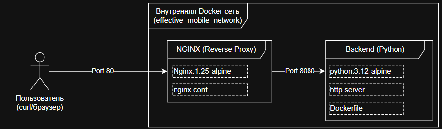

# Тестовое Effective Mobile: Nginx Proxy & Python Backend

  
Данный проект представляет собой реализацию простого отказоустойчивого веб-сервиса, развернутого с помощью Docker Compose. Архитектура построена на базе классической связки: **Reverse Proxy (Nginx)** и **Backend (Python)**.
## Архитектура проекта
### Схема взаимодействия

Взаимодействие между компонентами системы организовано следующим образом:



1. Пользователь отправляет HTTP-запрос на `http://localhost`.
2. Nginx принимает запрос на внешнем порту 80, обрабатывает его и перенаправляет во внутреннюю сеть на имя сервиса `backend:8080`.
3. Backend (Python) обрабатывает запрос и возвращает ответ "Hello from Effective Mobile!".
4. Безопасность: Прямой доступ к Backend-контейнеру извне закрыт; связь возможна только через Nginx.

**Nginx (Контейнер `effective_mobile_nginx`)**:
* Выступает в роли единой точки входа.
* Слушает порт `80` хост-машины.
* Проксирует входящие запросы на внутренний сервис `backend`.
* Передает заголовки `Host`, `X-Real-IP` и `X-Forwarded-For` для сохранения информации об исходном запросе.
**Backend (Контейнер `effective_mobile_backend`)**:
* Легковесный HTTP-сервер на Python (`http.server`).
* Работает внутри изолированной Docker-сети на порту `8080`.
* Запускается от имени непривилегированного пользователя (`appuser`) и не публикует порты во внешнюю сеть.
**Docker Network**:
* Используется кастомная сеть `effective_mobile_network` (драйвер `bridge`) для обеспечения связи между контейнерами по именам сервисов.
### Используемые технологии

- **Python 3.12 (Alpine)** — основной язык программирования и базовый образ для бэкенда.
- **http.server** — стандартная библиотека Python для создания HTTP-сервера.
- **Nginx (Alpine)** — высокопроизводительный HTTP-сервер, используемый в качестве Reverse Proxy.
- **Docker** — платформа для контейнеризации приложения.
- **Docker Compose** — инструмент для определения и запуска многоконтейнерных приложений.

---

## Пошаговая инструкция запуска

Для запуска проекта убедитесь, что у вас установлены **Docker** и **Docker Compose**.
[Docker](https://docs.docker.com/engine/install/)
[Docker Compose](https://docs.docker.com/compose/install/)

1. **Клонируйте репозиторий и перейдите в директорию проекта:**

```bash
git clone https://github.com/SergeyKaef/test-task.git

cd test-task
```

2. **Запустите сборку и старт контейнеров в фоновом режиме:**

Использование флага `-d` запустит сервисы в фоновом режиме.

```bash
docker compose up -d --build
```


3. **Проверьте статус контейнеров:**

Убедитесь, что оба контейнера имеют статус `Up` и прошли проверку работоспособности (`healthy`).

```bash
docker-compose ps
```

---
## Команда для проверки работоспособности

После того как контейнеры успешно запустились, вы можете проверить доступность приложения, выполнив запрос к локальному адресу:

```bash
curl http://localhost
```

**Ожидаемый ответ:**

```text
Hello from Effective Mobile!
```

*Если вы получили этот текст, значит цепочка Nginx → Backend работает корректно.*

---
## Дополнительные команды

* **Остановка и удаление проекта:**

```bash
docker-compose down
```